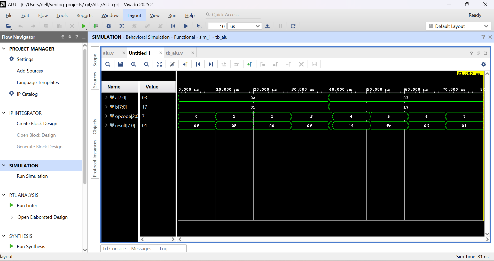

# ALU

## Overview

An 8-bit Arithmetic Logic Unit (ALU) implemented in Verilog HDL.

## Files

- alu.v

- tb\_alu.v

## Operations

- Addition

- Subtraction

- Bitwise AND

- Bitwise OR

- Bitwise XOR

- NOT

- Left shift

- Right shift

## Simulation

