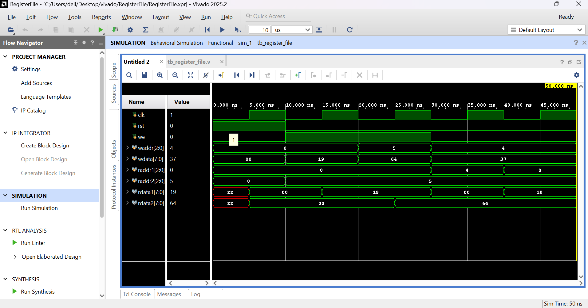

# Register File

## Overview

An 8×8 Register File implemented in Verilog HDL. The design supports synchronous write operations and asynchronous read operations.

## Files

- register_file.v

- tb_register_file.v

## Features

- 8 registers

- 8-bit data width

- Synchronous write

- Asynchronous read

- Reset support

## Simulation

