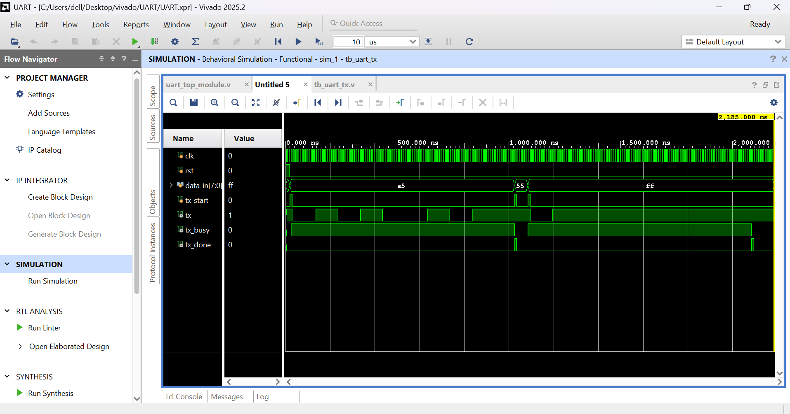
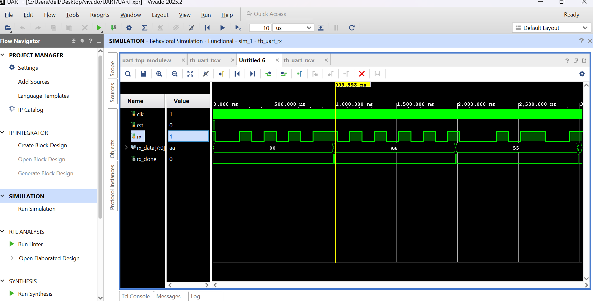
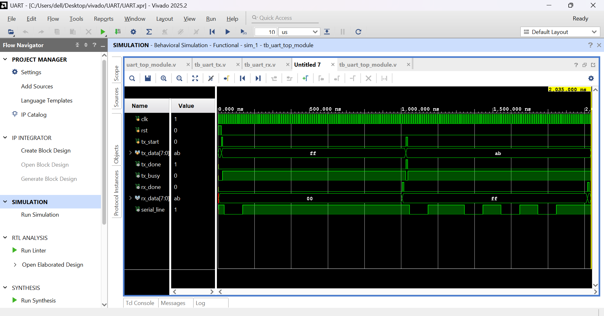

# UART

## Overview

A parameterized UART subsystem implemented in Verilog HDL, consisting of a transmitter, receiver, and top-level module. The design is verified using dedicated testbenches for the transmitter, receiver, and loopback communication.

## Files

- uart_tx.v

- uart_rx.v

- uart_top_module.v

- tb_uart_tx.v

- tb_uart_rx.v

- tb_uart_top_module.v

## Features

- Parameterized clock frequency

- Parameterized baud rate

- UART transmitter

- UART receiver

- Loopback verification

- FSM-based implementation

\## Simulation Instructions

1. Open the project in Xilinx Vivado.

2. Set one of the following as the simulation top module:

&#x20;  - `tb_uart_tx.v` – Verifies the UART transmitter.

&#x20;  - `tb_uart_rx.v` – Verifies the UART receiver.

&#x20;  - `tb_uart_top_module.v` – Verifies end-to-end UART loopback communication.

3. Run **Run Simulation → Run Behavioral Simulation**.

4. In the simulation window, click **Run All** to execute the complete testbench.

5. Compare the generated waveform with the corresponding waveform shown below.

## Simulation

### UART Transmitter

### UART Receiver

### UART Loopback

